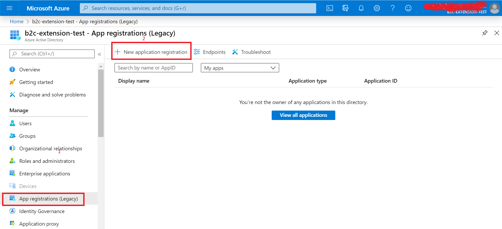
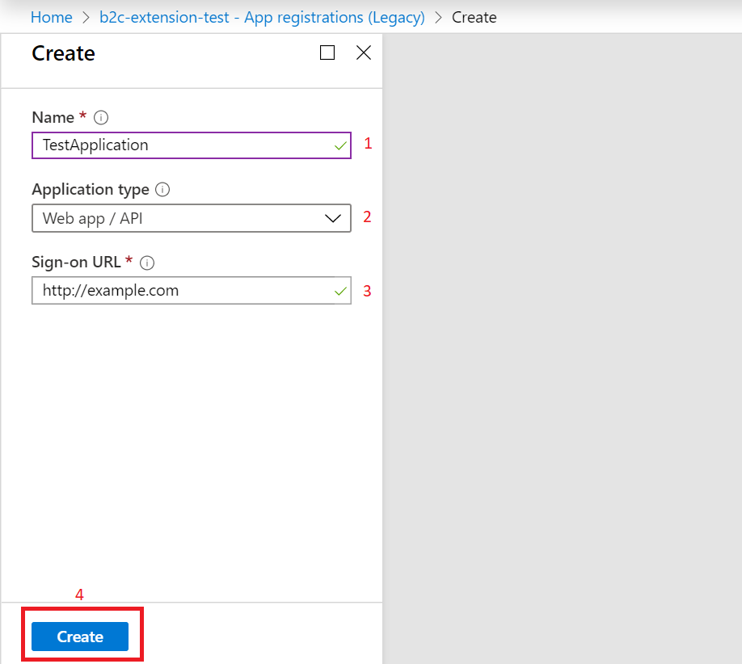
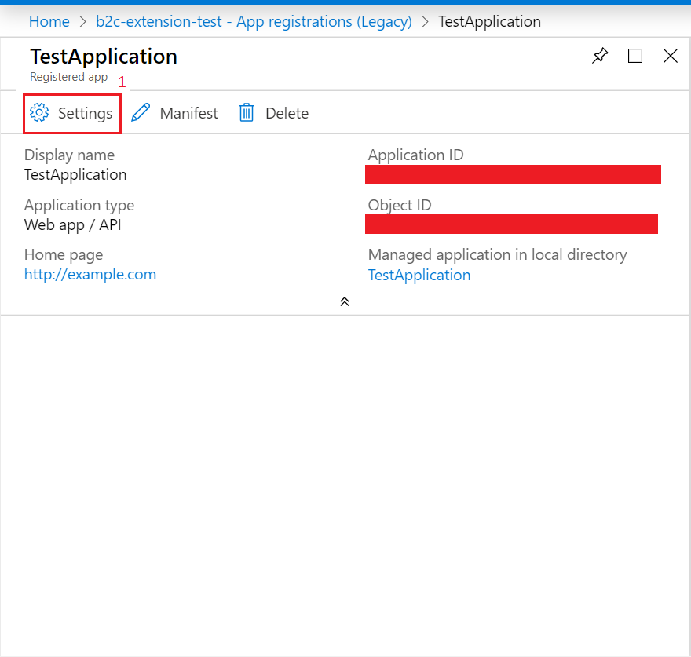
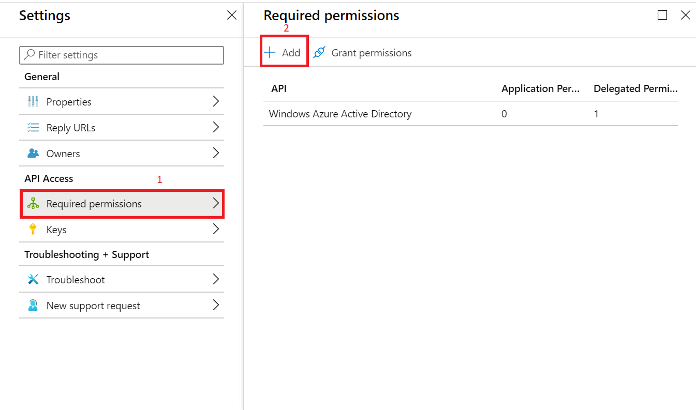
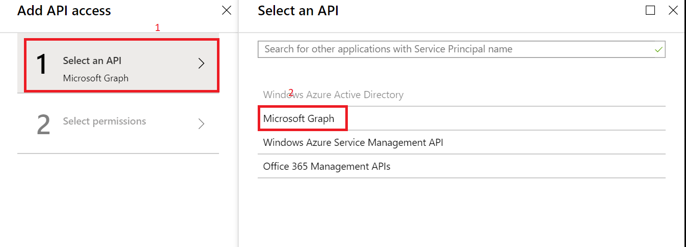
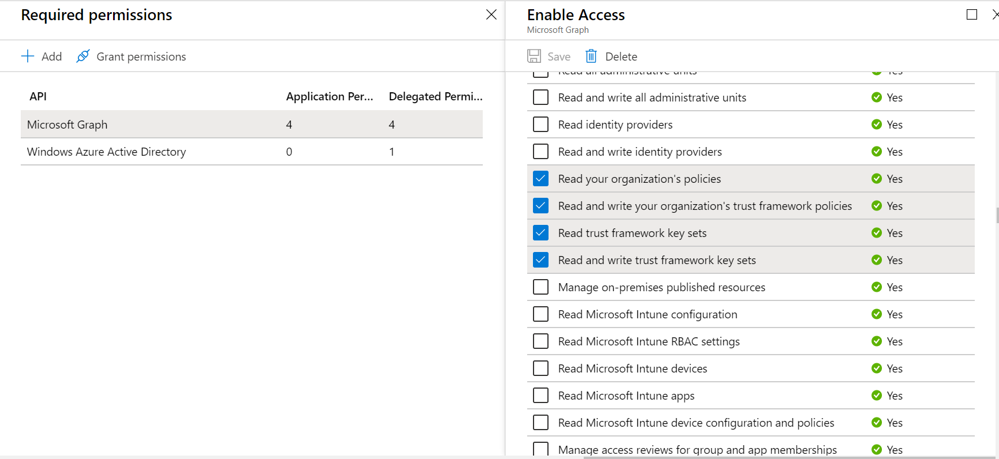
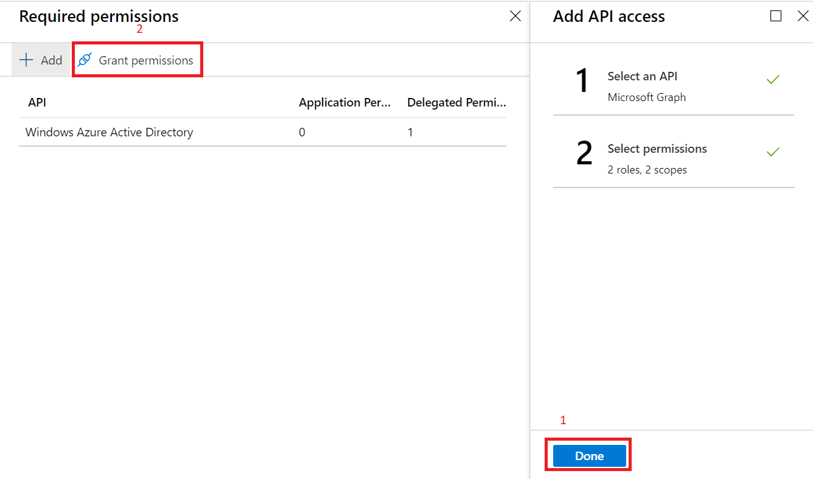
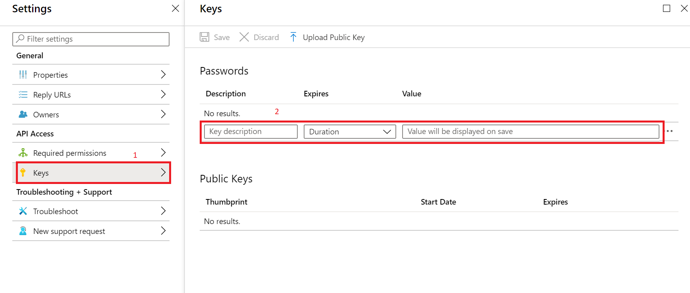
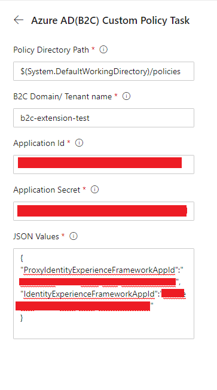

# Azure AD(B2C) Custom Policy Task
custom policy task is a utility to deploy b2c custom policies.
this build task enable following features
1. it will replace all the environment related configuration
2. it will create/update policies in azure 

# Installation and Configuration
1. Go to azure b2c tenant
2. Register an application in b2c tenant
    - Go to Azure Active Directory in b2c
    - Click on **App registrations (Legacy)** **1*
    
    - Click on **New application registration** **2*
    - Fill the details 
        - Name - Name of the application **1*
        - Application type - type of the application, select Web app/ API **2*
        - Sign-On URL - URL of you application (you can give any url) **3*
     - Click on **Create** button **4*
    
3. Now Click on **Settings**
    - copy the Application Id for future use

4. Permissions
    - Click on **Required permissions** **1*
        - we are using Microsoft Graph API's for creation and updation so for that we need some permissions. 
    - Click on **Add** **2*
     
    - Click on **Select an API** and Select **Microsoft Graph**
       
    - After selecting Microsoft Graph it will ask you for Permissions
        - Give Following Permissions
            - Delegate 
                - Read and write your organization's trust framework policies 
                - Read your organization's policies
                - Read trust framework key sets
                - Read and write trust framework key sets
            - Application
                - Read and write your organization's trust framework policies 
                - Read your organization's policies
                - Read trust framework key sets
                - Read and write trust framework key sets

        **Make Sure that Microsoft graph is showing Total 8 Permissions**
        

    - Click on **Done**  **1*
    - Click on **Grant permissions**  **2*
        - *this is most important step, please make sure this is done*
    
    - Now we will generate secret/Key
        - Select **Keys** **1*
        - Fill Details **2*
            - Key description 
            - Duration - please select Never expire
        - save and copy the secret for future use
    

    
   